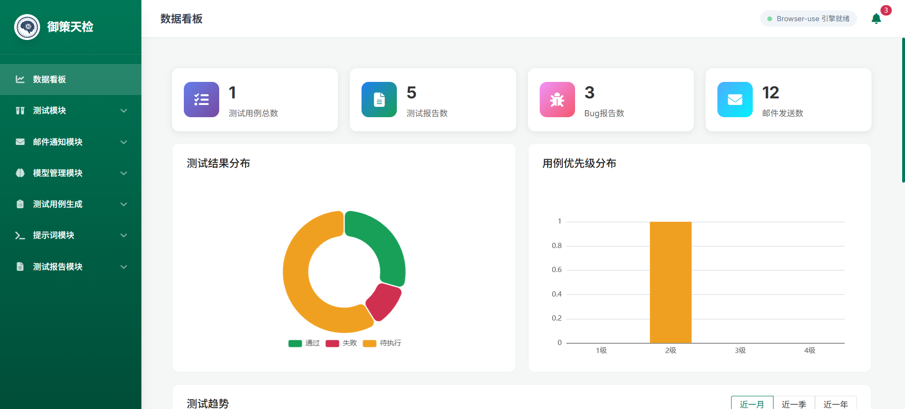
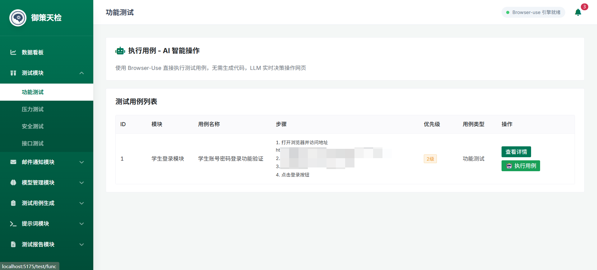
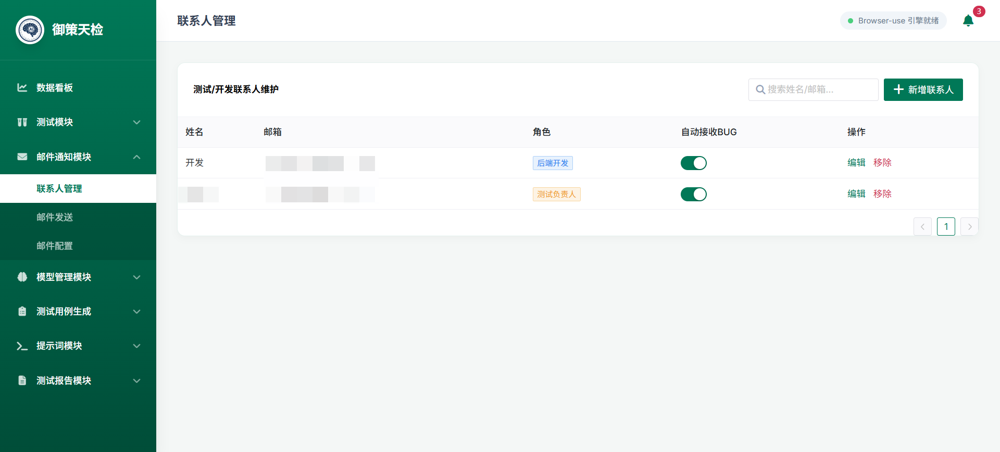
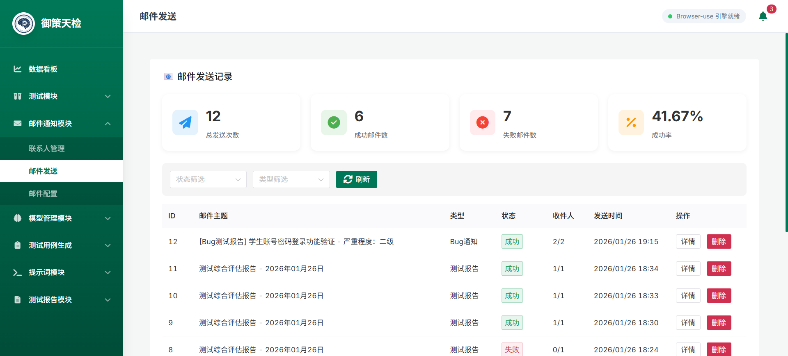
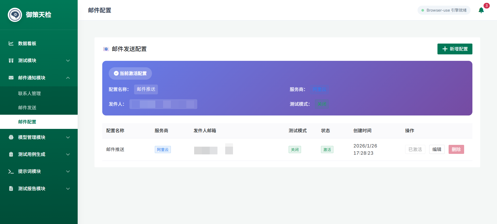
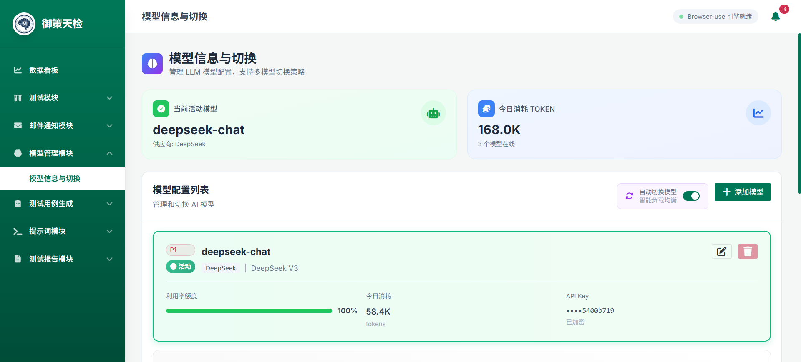
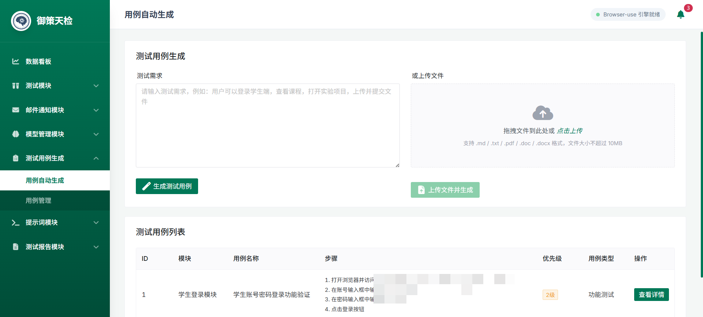
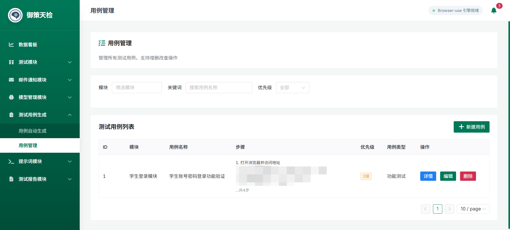
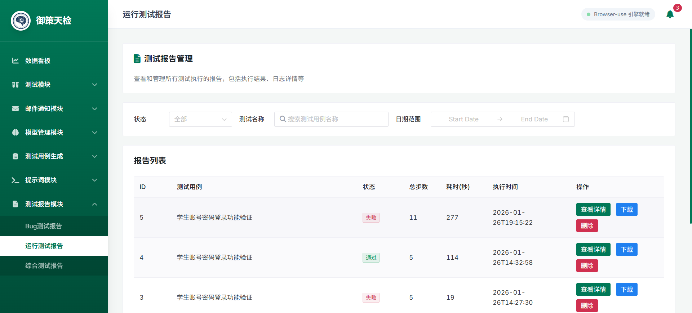
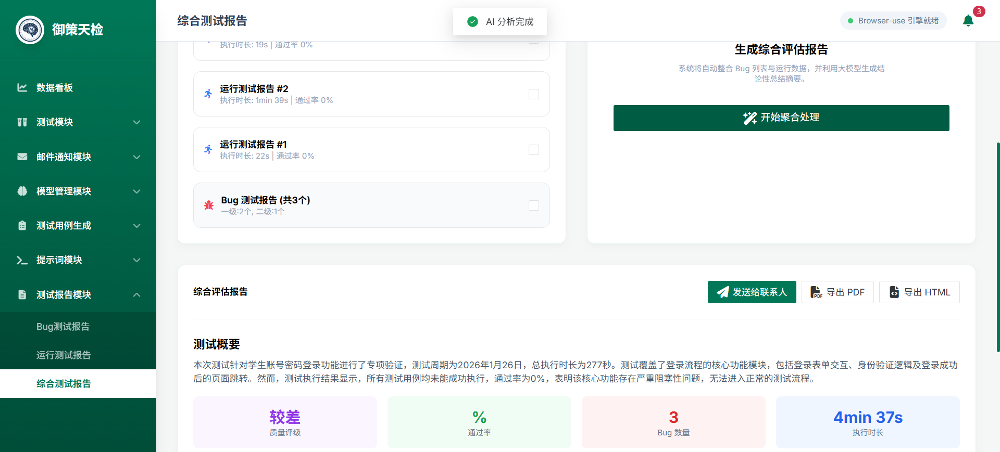

# AI Test Agent - 智能自动化测试平台（重构版）



## 项目简介

AI Test Agent 是一个基于人工智能的自动化测试平台，利用大语言模型（LLM）和浏览器自动化技术，实现测试用例的智能生成、自动执行、Bug 分析和报告生成。平台支持多种 LLM 模型，提供完整的测试生命周期管理，大幅提升测试效率。

## 核心特性

### 1. 智能测试用例生成
- 基于自然语言需求自动生成测试用例
- 支持多种文件格式导入（TXT、PDF、DOCX、DOC）
- 自动生成包含模块、标题、前置条件、测试步骤、预期结果等完整信息的测试用例
- 支持关键词标签和优先级设置

### 2. 自动化测试执行
- 基于 Browser-Use 0.11.1 的智能浏览器自动化
- 支持视觉识别和元素定位
- 自动截图和执行日志记录
- Token 使用量统计和成本计算
- 支持暂停/恢复/停止测试执行

### 3. 智能 Bug 分析
- 自动分析测试失败原因
- 智能判断 Bug 严重程度（一级致命、二级严重、三级一般、四级轻微）
- 自动提取复现步骤和错误类型
- 自动生成 Bug 截图并按规范命名
- 支持 Bug 状态跟踪

### 4. 自动报告生成
- 基于测试结果自动生成测试报告
- 支持 Markdown 和 HTML 格式
- 包含测试统计、执行详情、Bug 分析等完整信息
- 支持综合评估报告

### 5. 邮件通知系统
- 支持 Resend 和阿里云邮件服务
- 自动发送测试报告和 Bug 通知
- 支持联系人管理和自动接收 Bug 设置
- 测试模式支持，避免误发

### 6. 多模型管理
- 支持多个 LLM 模型配置
- 模型激活和切换
- Token 使用量统计
- 模型利用率和优先级管理

## 技术架构

### 后端技术栈
- **框架**: FastAPI 0.115.0
- **服务器**: Uvicorn 0.32.0
- **数据库**: MySQL + SQLAlchemy 2.0.25
- **浏览器自动化**: Browser-Use 0.11.1 + Playwright 1.49.1
- **LLM 集成**: OpenAI API（支持多种模型）
- **邮件服务**: Resend 2.6.0
- **文档处理**: PyPDF2、python-docx
- **数据处理**: Pandas 2.3.3

### 前端技术栈
- **框架**: Vue 3.4.0
- **UI 组件**: Naive UI 2.38.0
- **路由**: Vue Router 4.2.5
- **状态管理**: Pinia 2.1.7
- **HTTP 客户端**: Axios 1.6.0
- **图表**: ECharts 6.0.0
- **样式**: TailwindCSS 3.4.0
- **构建工具**: Vite 5.0.0

## 项目结构

```
Ai_Test_Agent/
├── Agent_server/              # 后端服务
│   ├── Api_request/          # LLM API 调用
│   ├── Bug_Analysis/         # Bug 分析服务
│   ├── Build_Report/        # 报告生成服务
│   ├── Build_test_code/      # 测试代码生成服务
│   ├── Build_tests/          # 测试用例生成服务
│   ├── Contact_manage/       # 联系人管理
│   ├── Dashboard/            # 仪表板
│   ├── Email_manage/         # 邮件管理
│   ├── Model_manage/         # 模型管理
│   ├── browser_use_core/     # Browser-Use 核心功能
│   ├── database/             # 数据库连接和模型
│   ├── mcp_utils/            # MCP 工具
│   ├── app.py                # FastAPI 主应用
│   └── requirements.txt      # Python 依赖
├── agent_web_server/         # 前端服务
│   ├── src/
│   │   ├── api/             # API 接口
│   │   ├── components/      # 公共组件
│   │   ├── layouts/         # 布局组件
│   │   ├── router/          # 路由配置
│   │   ├── styles/          # 样式文件
│   │   └── views/           # 页面视图
│   │       ├── case/        # 用例管理
│   │       ├── dashboard/   # 仪表板
│   │       ├── mail/        # 邮件管理
│   │       ├── model/       # 模型管理
│   │       ├── prompt/      # 提示词管理
│   │       ├── report/      # 报告查看
│   │       └── test/        # 测试执行
│   ├── index.html
│   └── package.json
└── save_floder/              # 保存目录
    ├── bug_floder/          # Bug 截图
    ├── img/                 # 项目截图
    └── uploads/             # 上传文件
```

## 功能模块

### 1. Dashboard 仪表板


提供测试概况、统计图表和快速操作入口，包括：
- 测试用例统计
- 测试执行趋势
- Bug 分布情况
- Token 使用量统计

### 2. 测试用例管理


- 测试用例列表查看和筛选
- 支持按模块、优先级、关键词搜索
- 测试用例详情查看和编辑
- CSV 文件导出

### 3. 测试用例生成


- 自然语言需求输入
- 文件上传支持（TXT、PDF、DOCX、DOC）
- 自动生成测试用例
- 批量生成支持

### 4. 测试执行


- 选择测试用例执行
- 实时查看执行进度
- 支持暂停/恢复/停止
- 执行日志和截图查看

### 5. 测试报告


- 测试报告列表
- 报告详情查看
- 支持多种格式（Markdown、HTML）
- 综合评估报告生成

### 6. Bug 报告


- Bug 列表查看
- 按严重程度筛选
- Bug 详情和截图
- Bug 状态跟踪

### 7. 模型管理


- 多模型配置
- 模型激活/切换
- Token 使用量统计
- 模型利用率管理

### 8. 邮件配置


- 邮件服务商配置（Resend、阿里云）
- 测试模式支持
- 联系人管理
- 自动接收 Bug 设置

### 9. 联系人管理


- 联系人列表管理
- 角色设置
- 自动接收 Bug 配置

### 10. 综合报告


- 多测试报告综合分析
- Bug 统计和分析
- LLM 智能评估
- 专业测试建议

## 快速开始

### 环境要求
- Python 3.11+
- Node.js 18+
- MySQL 8.0+
- Chrome/Edge 浏览器

### 后端部署

1. **克隆项目**
```bash
git clone <repository-url>
cd Ai_Test_Agent/Agent_server
```

2. **安装依赖**
```bash
pip install -r requirements.txt
```

3. **配置环境变量**
创建 `.env` 文件并配置以下参数：
```env
# 数据库配置
DB_HOST=localhost
DB_PORT=3306
DB_USER=root
DB_PASSWORD=your_password
DB_NAME=ai_test_agent

# LLM 配置
LLM_BASE_URL=https://api.openai.com/v1
LLM_API_KEY=your_api_key
LLM_MODEL=gpt-4
LLM_TEMPERATURE=0.0
LLM_USE_VISION=false

# 浏览器配置
HEADLESS=false
BROWSER_WINDOW_WIDTH=1920
BROWSER_WINDOW_HEIGHT=1200
MAX_STEPS=100
MAX_ACTIONS=10

# 邮件配置
RESEND_API_KEY=your_resend_api_key
RESEND_SENDER=noreply@yourdomain.com

# 服务器配置
HOST=0.0.0.0
PORT=8000
DEBUG=True
CORS_ORIGINS=http://localhost:5175

# 保存目录
SAVE_FOLDER_DIR=../save_floder
```

4. **初始化数据库**
```bash
python -c "from database.connection import init_db; init_db()"
```

5. **启动后端服务**
```bash
python app.py
```

后端服务将在 http://localhost:8000 启动

API 文档访问：
- Swagger UI: http://localhost:8000/docs
- ReDoc: http://localhost:8000/redoc

### 前端部署

1. **进入前端目录**
```bash
cd ../agent_web_server
```

2. **安装依赖**
```bash
npm install
```

3. **配置 API 地址**
修改 `src/api/index.js` 中的 API_BASE_URL 为后端服务地址

4. **启动开发服务器**
```bash
npm run dev
```

前端服务将在 http://localhost:5175 启动

5. **构建生产版本**
```bash
npm run build
```

## 使用指南

### 1. 配置 LLM 模型
- 进入"模型管理"页面
- 添加 LLM 模型配置（支持 OpenAI、DeepSeek、Claude 等）
- 激活要使用的模型

### 2. 生成测试用例
- 进入"用例生成"页面
- 输入测试需求或上传需求文档
- 点击"生成测试用例"
- 查看生成的测试用例并保存

### 3. 执行测试
- 进入"测试执行"页面
- 选择要执行的测试用例
- 配置执行参数（无头模式、最大步数等）
- 点击"开始执行"
- 实时查看执行进度和日志

### 4. 查看 Bug
- 测试执行失败后，系统自动分析 Bug
- 进入"Bug 报告"页面查看
- 查看 Bug 详情、截图和复现步骤
- 跟踪 Bug 修复状态

### 5. 生成报告
- 进入"测试报告"页面
- 选择测试结果生成报告
- 查看报告详情
- 导出或分享报告

### 6. 配置邮件通知
- 进入"邮件配置"页面
- 配置邮件服务商（Resend 或阿里云）
- 添加联系人并设置自动接收 Bug
- 测试邮件发送功能

## 数据库表结构

### test_cases - 测试用例表
| 字段 | 类型 | 说明 |
|------|------|------|
| id | Integer | 主键ID |
| module | String(100) | 所属模块 |
| title | String(200) | 用例标题 |
| precondition | Text | 前置条件 |
| steps | Text | 测试步骤（JSON格式） |
| expected | Text | 预期结果 |
| keywords | String(200) | 关键词 |
| priority | String(20) | 优先级（1-4级） |
| case_type | String(50) | 用例类型 |
| stage | String(50) | 适用阶段 |
| test_data | JSON | 测试数据 |
| created_at | DateTime | 创建时间 |
| updated_at | DateTime | 更新时间 |
| csv_file_path | String(500) | CSV文件路径 |

### test_results - 测试结果表
| 字段 | 类型 | 说明 |
|------|------|------|
| id | Integer | 主键ID |
| test_code_id | Integer | 关联测试代码ID |
| test_case_id | Integer | 关联测试用例ID |
| execution_log | LONGTEXT | 执行日志 |
| screenshots | JSON | 截图路径（JSON数组） |
| status | String(20) | 测试结果（pass/fail/error） |
| error_message | LONGTEXT | 错误信息 |
| executed_at | DateTime | 执行时间 |
| duration | Integer | 执行耗时（秒） |

### bug_reports - Bug 报告表
| 字段 | 类型 | 说明 |
|------|------|------|
| id | Integer | 主键ID |
| bug_name | String(200) | Bug名称 |
| test_case_id | Integer | 关联测试用例ID |
| test_result_id | Integer | 关联测试结果ID |
| location_url | String(500) | 定位地址 |
| error_type | String(50) | 错误类型 |
| severity_level | String(20) | 严重程度（一级/二级/三级/四级） |
| reproduce_steps | Text | 复现步骤（JSON格式） |
| screenshot_path | String(500) | 失败截图路径 |
| result_feedback | Text | 结果反馈 |
| expected_result | Text | 预期结果 |
| actual_result | Text | 实际结果 |
| status | String(20) | Bug状态 |
| created_at | DateTime | 创建时间 |
| updated_at | DateTime | 更新时间 |

### llm_models - LLM 模型配置表
| 字段 | 类型 | 说明 |
|------|------|------|
| id | Integer | 主键ID |
| model_name | String(100) | 模型名称 |
| api_key | String(500) | API密钥 |
| base_url | String(500) | API基础URL |
| provider | String(50) | 模型供应商 |
| is_active | Integer | 是否激活（0:否 1:是） |
| priority | Integer | 优先级（1/2/3） |
| utilization | Integer | 利用率百分比 |
| tokens_used_today | Integer | 今日消耗TOKEN |
| status | String(50) | 模型状态 |
| created_at | DateTime | 创建时间 |
| updated_at | DateTime | 更新时间 |

## API 接口

### 测试用例相关
- `POST /api/test-cases/generate` - 生成测试用例
- `GET /api/test-cases` - 获取测试用例列表
- `GET /api/test-cases/{id}` - 获取测试用例详情
- `PUT /api/test-cases/{id}` - 更新测试用例
- `POST /api/test-cases/upload` - 上传文件生成测试用例

### 测试执行相关
- `POST /api/test-code/execute` - 执行测试
- `POST /api/test-code/stop` - 停止测试
- `POST /api/test-code/pause` - 暂停测试
- `POST /api/test-code/resume` - 恢复测试
- `GET /api/test-code/status/{task_id}` - 获取执行状态

### 报告相关
- `POST /api/reports/generate` - 生成测试报告
- `GET /api/reports` - 获取报告列表
- `GET /api/reports/{id}` - 获取报告详情
- `POST /api/reports/mixed` - 生成综合评估报告

### Bug 分析相关
- `GET /api/bugs` - 获取 Bug 列表
- `GET /api/bugs/{id}` - 获取 Bug 详情
- `PUT /api/bugs/{id}` - 更新 Bug 状态

### 模型管理相关
- `POST /api/models` - 添加模型配置
- `GET /api/models` - 获取模型列表
- `PUT /api/models/{id}/activate` - 激活模型
- `DELETE /api/models/{id}` - 删除模型

### 邮件相关
- `POST /api/email/config` - 配置邮件服务
- `GET /api/email/config` - 获取邮件配置
- `POST /api/email/send` - 发送邮件
- `POST /api/contacts` - 添加联系人
- `GET /api/contacts` - 获取联系人列表

## 常见问题

### 1. 浏览器启动失败
- 确保已安装 Chrome 或 Edge 浏览器
- 检查浏览器驱动是否正确安装
- 尝试关闭无头模式（HEADLESS=false）

### 2. LLM 调用失败
- 检查 API Key 是否正确
- 确认 Base URL 配置正确
- 检查网络连接和代理设置

### 3. 数据库连接失败
- 确认 MySQL 服务已启动
- 检查数据库连接配置
- 确认数据库用户权限

### 4. 邮件发送失败
- 检查邮件服务商 API Key
- 确认发件人邮箱已验证
- 检查收件人邮箱地址

## 开发指南

### 添加新的测试用例模板
编辑 `Agent_server/Api_request/prompts.py` 中的提示词模板

### 自定义浏览器操作
编辑 `Agent_server/Build_test_code/custom_actions.py` 添加自定义操作

### 扩展 Bug 分析规则
编辑 `Agent_server/Bug_Analysis/service.py` 修改分析逻辑

### 添加新的报告格式
编辑 `Agent_server/Build_Report/service.py` 添加新的报告生成逻辑

## 贡献指南

欢迎提交 Issue 和 Pull Request！

## 许可证

MIT License

## 联系方式
邮箱：eighteenstuai@gmail.com

---

**AI Test Agent** - 让自动化测试更智能、更高效！
